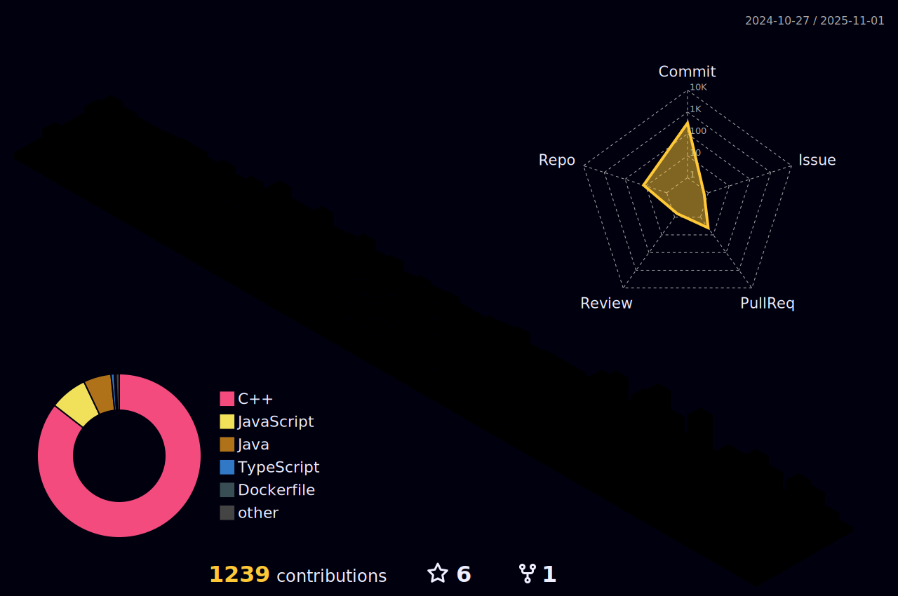

  

<h1 align="center">

</h1>
<h2 align="center">I am a Software Developer & Web Developer🦖</h2>

  
🔭 I’m currently working on **App & Web Development**

🌱 Have an idea you can reach me

📫 How to reach me **prathamasrani.cs@gmail.com**

  
   
  

 
  <h1 align="center">Technologies and Frameworks</h1>

      

<h2 align="center">⚡ Stats ⚡</h2>
 

 
  

## GitHub Profile Summary Card
 

## GitHub Contribution Summary

  <h2>🐍 My Contributions 🐍</h2>
   
  
  
     

